# Система учёта успеваемости студентов

Веб-приложение для автоматизации учёта студентов, преподавателей, предметов и оценок в учебном заведении.

Проект разработан на языке **PHP** с использованием **MySQL** и реализует систему разграничения доступа по ролям (администратор, преподаватель и студент).

---

## Возможности системы

### Администратор:
- Добавление и редактирование преподавателей
- Добавление студентов и групп
- Создание и управление предметами
- Привязка преподавателей к предметам
- Управление пользователями системы

### Преподаватель:
- Просмотр только своих предметов
- Выставление оценок студентам
- Просмотр всех выставленных оценок
- Удаление собственных оценок

### Студент:
- Просмотр своих оценок

---

## Авторизация и безопасность

- Используется сессионная авторизация
- Реализована проверка ролей пользователей
- Используются подготовленные SQL-запросы (`prepare`)
- Преподаватель имеет доступ только к своим данным

---

## Структура базы данных (основные таблицы)

- `users` — пользователи системы  
- `teachers` — преподаватели  
- `students` — студенты  
- `groups_college` — учебные группы  
- `subjects` — предметы  
- `teacher_subjects` — связь преподавателей и предметов  
- `grades` — оценки студентов  

---

## Используемые технологии

- PHP 8+
- MySQL
- HTML5
- CSS3
- mysqli

---

## Назначение проекта

Проект разработан в учебных целях для демонстрации навыков:
- работы с PHP и MySQL
- построения CRUD-систем
- реализации ролевой модели доступа
- организации структуры веб-приложения

---

## Структура проекта и назначение файлов

### Конфигурация
- `config.php`  
  Подключение к базе данных (настройки MySQL, создание соединения).

- `includes/auth.php`  
  Проверка авторизации пользователя и контроль доступа по ролям.

- `logout.php`  
  Завершение сессии и выход из системы.

---

### Административная часть (`/admin`)
- `admin_panel.php`  
  Главная панель администратора. Управление преподавателями, студентами, предметами и привязками.

---

### Панель преподавателя (`/teacher`)
- `teacher_panel.php`  
  Главная страница преподавателя.  
  Отображает:
  - список студентов
  - свои предметы
  - таблицу выставленных оценок
  - возможность удаления своих оценок

- `add_grade.php`  
  Страница выставления оценок.  
  Позволяет преподавателю:
  - выбрать студента
  - выбрать только свой предмет
  - выставить оценку
  - сохранить её в базе данных

---

### Панель студента (`/student`)
- `student_panel.php`  
  Главная страница студента.  
  Отображает:
  - личную информацию
  - список своих оценок
  - предметы, по которым выставлены оценки
  - даты выставления оценок
  
---

##  Логика работы системы

1. Пользователь проходит авторизацию.
2. В зависимости от роли (`admin` или `teacher` или `student`) загружается соответствующая панель.
3. Преподаватель может работать только со своими предметами.
4. Все действия фиксируются в базе данных.
5. Доступ к данным ограничен ролью пользователя.

---

##  Визуальное взаиодействие

---

### Общая часть
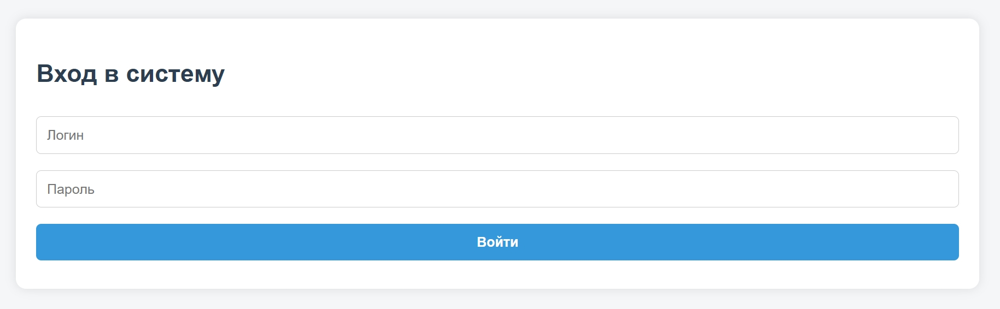

---

### Административная часть

    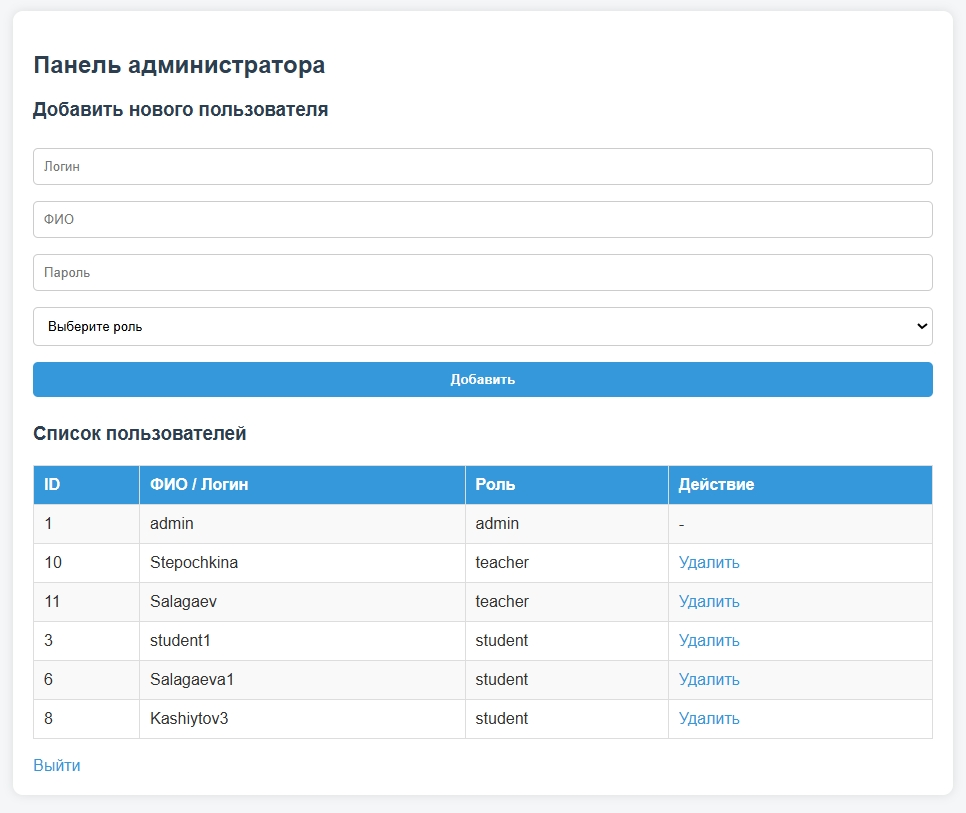
    
Панель администратора с внесёнными данными, полученными как через базу, так и через саму панель.

    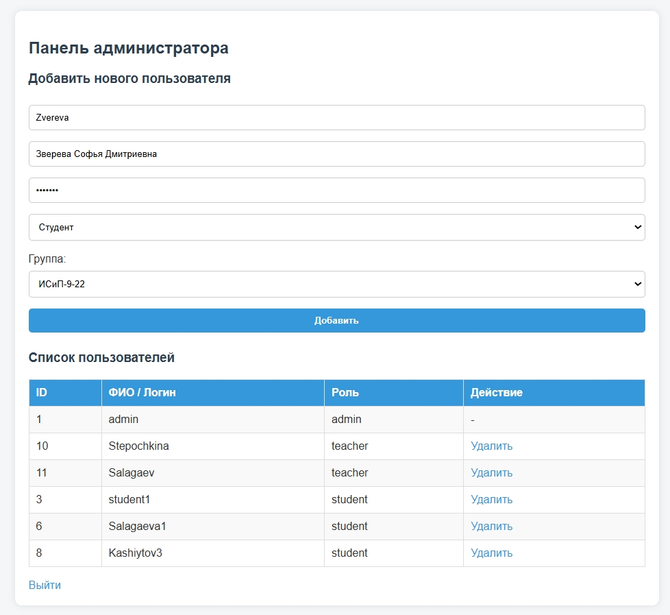
    
Панель администратора при внесении данных студента в поля.

    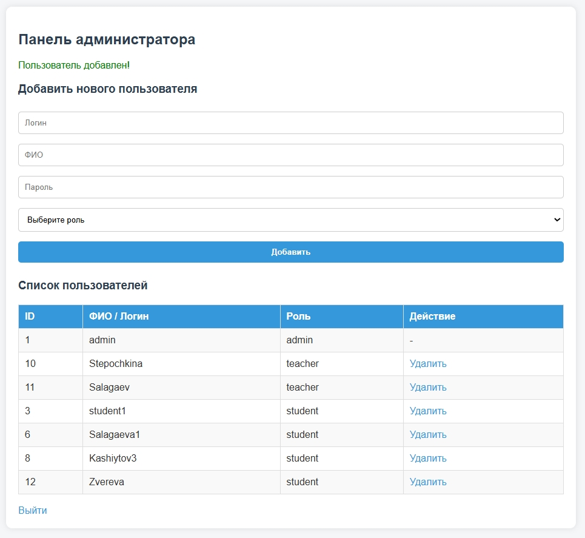
    
Успешное добавление студента в систему.

    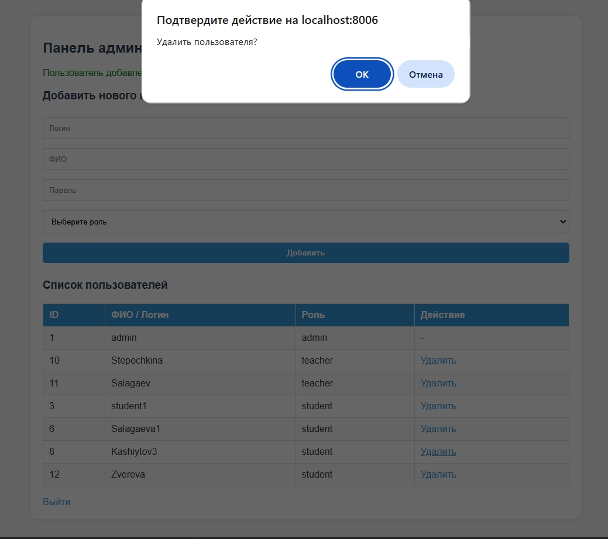
    
Удаление студента из системы. Происходит удаление и других связанных участников.

    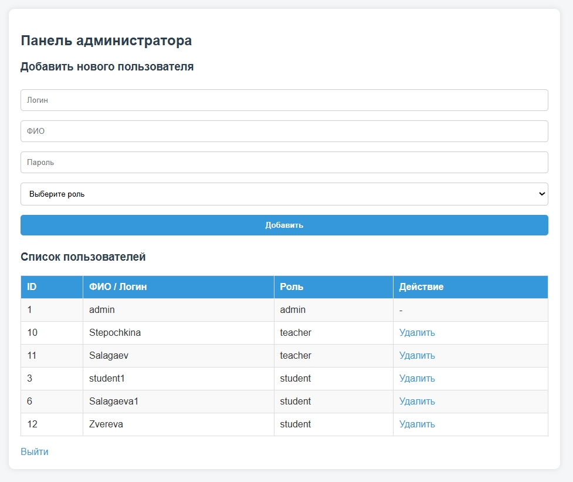
    
Успешное удаление студента из системы.

    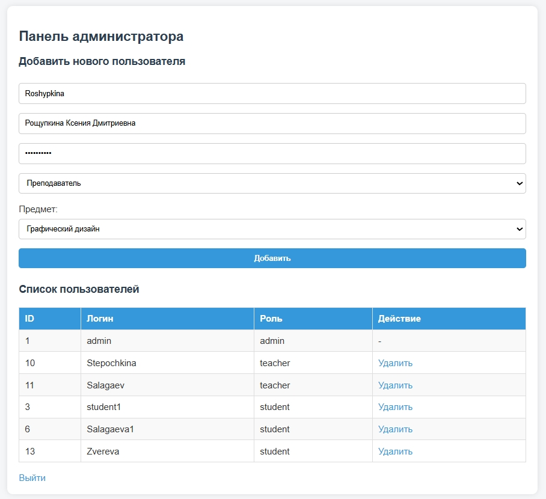
    
Добавление преподавателя в систему.

    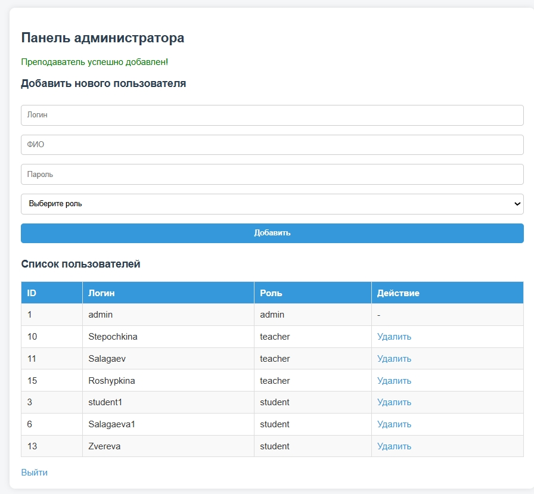
    
Успешное добавление преподавателя в систему.

---

### Преподавательская часть

    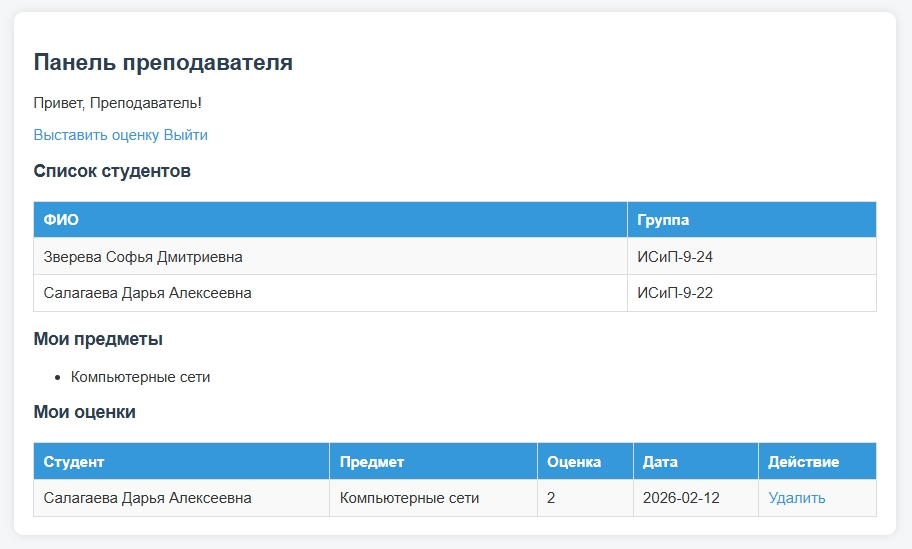
    
Панель преподавателя при входе в систему.

    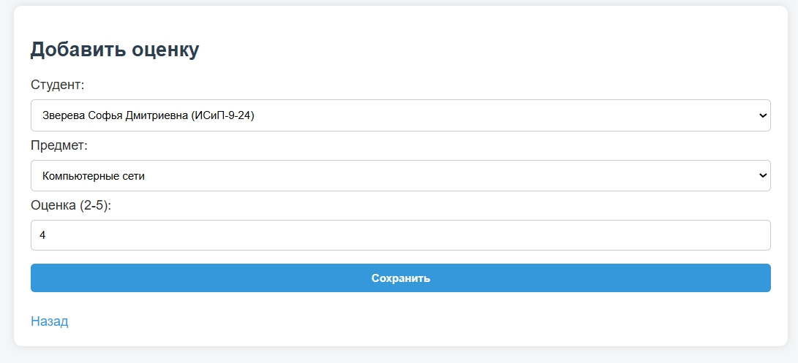
    
Панель преподавателя с внесёнными данными студента.

    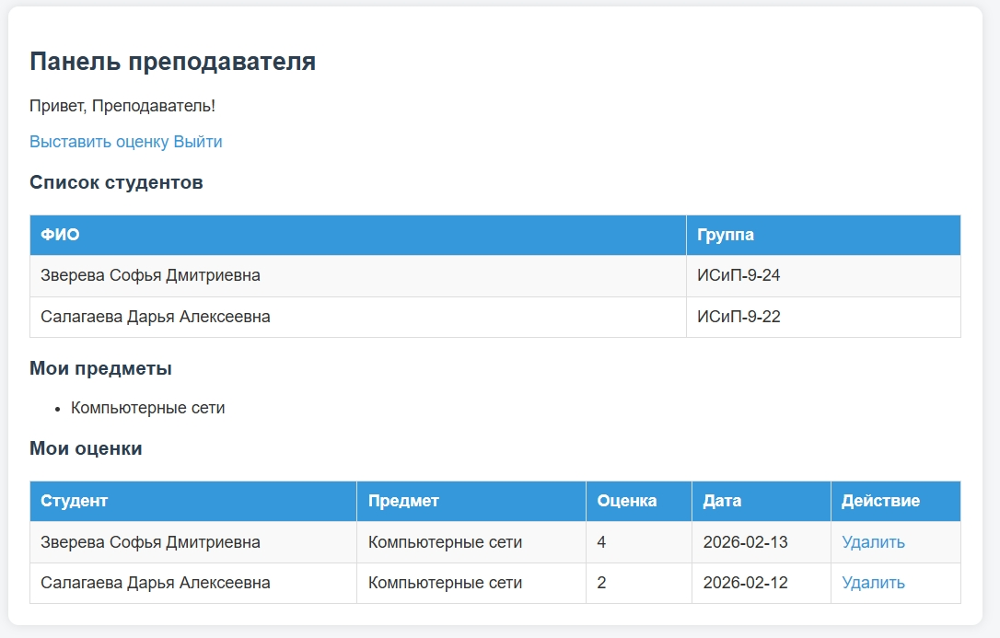
    
Успешное добавление оценки студенту.

---

### Студенческая часть

    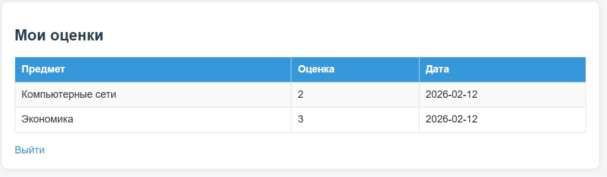
    
Панель студента.

---

## Вывод

Данная ИС позволяет автоматизировать процесс учёта успеваемости студентов в учебном заведении, обеспечивая разграничение доступа для различных ролей пользователей:

- **Администратор** может управлять всеми участниками системы, назначать преподавателей на конкретные предметы и студентов на группы.  
- **Преподаватель** получает доступ только к своим предметам, может выставлять и удалять оценки, обеспечивая контроль за успеваемостью.  
- **Студент** имеет возможность просматривать свои оценки и следить за прогрессом по каждому предмету.

Реализация системы на **PHP** и **MySQL** с использованием подготовленных SQL-запросов и ролевой модели обеспечивает безопасность данных и надёжное управление доступом.  

Проект демонстрирует практические навыки работы с веб-технологиями, построения CRUD-систем, организации ролевого доступа и структурирования базы данных для реальных учебных сценариев.  

Система может быть использована как основа для более сложных учебных или производственных приложений с учётом расширения функционала и интеграции с другими сервисами.

---

© 2026 Учебный проект
